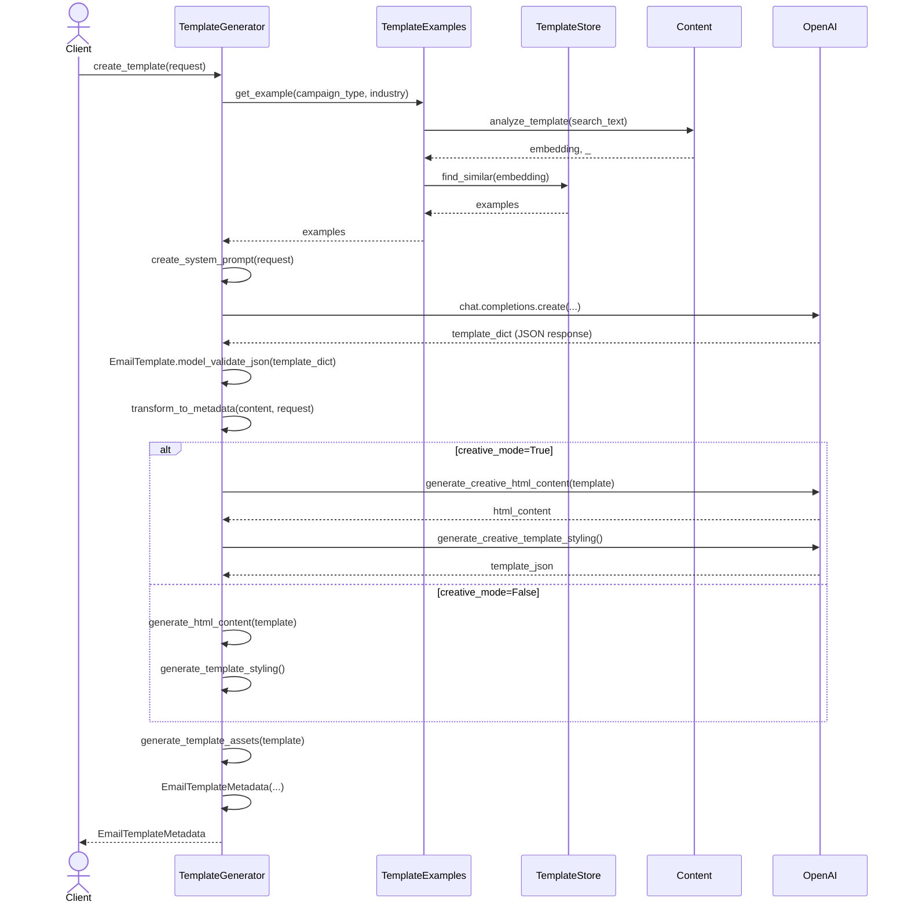

## Template Generation
### Key Components

- **TemplateGenerator**: Core module that orchestrates the template generation process
- **TemplateExamples**: Provides relevant template examples using content analysis
- **TemplateStore**: Stores and retrieves templates using vector similarity
- **Content**: Analyzes template content and creates embeddings
- **OpenAI**: External service used for generating template content and styling 

## Process Breakdown

1. **Request Intake**: Client submits a `TemplateRequest` with parameters like industry, campaign type, tone, and target audience.

2. **Example Identification**:
   - The system searches for relevant template examples based on campaign type and industry
   - Content analysis is performed to find semantic matches
   - Similar templates are retrieved from the TemplateStore (a pgvector database)

3. **Content Generation**:
   - A system prompt is created incorporating example templates
   - OpenAI's API is called to generate the email template content
   - The response is validated and parsed into an `EmailTemplate` object

4. **Template Transformation**:
   - The content is transformed into a complete template with styling and structure
   - If creative mode is enabled, AI generates more personalized HTML and styling
   - Otherwise, standard templating functions are used

5. **Asset Generation**:
   - Template assets (HTML file, thumbnails) are generated
   - A unique template ID is created

6. **Template Return**:
   - A complete `EmailTemplateMetadata` object is returned to the client

