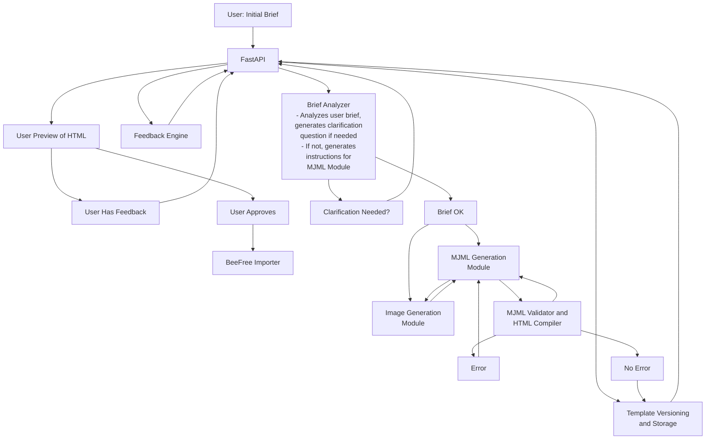

# Xyra Marketing Content Agent - Phase 1 Plan: MJML Email Template Generation

## 1. Project Overview & Phase 1 Goals

This document outlines the plan for Phase 1 of the Xyra Marketing Content Agent project. The primary goal is to develop an AI-powered agent capable of generating professional-grade, responsive email templates in MJML format. This phase will also include the capability to generate relevant imagery, allow for iterative refinement through natural language feedback, and import the final HTML (compiled from MJML) into the Beefree WYSWYG editor.

**Key Objectives for Phase 1 (derived from [`instructions.md`](instructions.md:1)):**

*   **MJML Generation:**
    *   Accept textual content briefs, subject lines, body copy, and image suggestions as input.
    *   Generate high-quality, responsive MJML templates directly from user input.
    *   Utilize AI for structured and reliable MJML generation.
*   **AI-Driven Input Clarification:**
    *   Before generation, employ AI to analyze the user's initial brief, identify critical ambiguities or missing information, and ask targeted clarifying questions.
*   **Image Generation:**
    *   Automate image generation using DALL-E 3 or a similar technology, ensuring high-quality, visually consistent assets relevant to the email content.
*   **Iterative Refinement Loop:**
    *   Allow users to preview the generated template (HTML compiled from MJML).
    *   Enable users to request changes using natural language.
    *   Use AI to interpret feedback and modify the MJML source.
*   **Versioning:**
    *   Implement a system for versioning templates as they are refined.
*   **MJML to HTML Compilation:**
    *   Provide automatic compilation from the generated MJML to HTML.
    *   Ensure inline CSS for maximum compatibility across email clients.
*   **Beefree Integration (Phase 1.1):**
    *   Integrate with the Beefree HTML Importer API (`https://docs.beefree.io/beefree-sdk/apis/html-importer-api`) to pull the compiled HTML into their platform.
*   **System template:**
    *   template the system with future scalability in mind, particularly for integrating a Retrieval Augmented Generation (RAG) component and for expanding to other marketing channels.

## 2. Proposed Architecture for Phase 1

The Phase 1 architecture will employ a **fully asynchronous request/response pattern** for all potentially long-running operations (including AI interactions, image generation, compilation, and external API calls). This ensures system responsiveness and scalability. Clients will initiate an operation and then poll a status endpoint to track progress and retrieve results. The FastAPI application will serve as the central orchestrator for these asynchronous processes, managing background tasks and state updates.



**Component Interaction:** The FastAPI application serves as the central orchestrator for all interactions, managing asynchronous tasks and state transitions. Clients interact by initiating operations and then polling for status updates.

1.  **User Input & AI Clarification (Asynchronous):**
    *   The user submits an initial brief to `FastAPI` (e.g., via `POST /templates`). `FastAPI` returns a `202 Accepted` response with a `task_id` and `status_poll_url`.
    *   `FastAPI` initiates an asynchronous background task to route the brief to the `Brief Analyzer`.
    *   The `Brief Analyzer` processes the brief. `FastAPI` updates the task status (e.g., in `Template Versioning and Storage` or a task store).
    *   The client polls the `status_poll_url` (e.g., `GET /templates/{template_id}/status`).
    *   If clarification is needed, the status reflects this (e.g., `clarification_needed`), and the response includes the questions and a token for submitting an amended brief. The user submits the amended brief (e.g., via `PUT /templates/{template_id}/brief`), which again triggers an asynchronous process.
    *   If the brief is OK, the status reflects this (e.g., `pending_initial_generation`), and `FastAPI` proceeds to the next stage.

2.  **Initial Generation & Versioning (Asynchronous):**
    *   Once the brief is OK, `FastAPI` initiates asynchronous background tasks for the `Image Generation Module` and the `MJML Generation Module`.
    *   These modules produce assets and the initial MJML. The `MJML Generation Module` may trigger further async image tasks if needed.
    *   The generated MJML is passed to the `MJML Validator and HTML Compiler` (as another async step or part of the generation task).
    *   If validation errors occur, the task status is updated to reflect an error (e.g., `error_generation`), and details may be provided. The `MJML Generation Module` might be re-triggered with corrections if templateed for auto-retry, or user intervention might be flagged.
    *   If successful, the compiled HTML is processed by `FastAPI`, which stores this initial version in `Template Versioning and Storage` and updates the task status to `ready_for_preview`.

3.  **Preview & Refinement Loop (Asynchronous):**
    *   The client, upon seeing the `ready_for_preview` status from polling, retrieves the HTML for `User Preview of HTML` (e.g., via `GET /templates/{template_id}/versions/{version_id}/html`).
    *   If the user has feedback, they submit it to `FastAPI` (e.g., via `POST /templates/{template_id}/feedback`). `FastAPI` returns `202 Accepted`.
    *   `FastAPI` initiates an asynchronous task, providing the natural language feedback and the current MJML (retrieved from `Template Versioning and Storage`) to the `Feedback Engine`.
    *   The `Feedback Engine` returns structured change instructions to `FastAPI` (as part of the async task's completion).
    *   `FastAPI` then initiates another asynchronous task for the `MJML Generation Module` with these structured changes and the current MJML.
    *   This updated MJML goes through the asynchronous validation/compilation process. If valid, the new version is stored, and the status is updated to `ready_for_preview` for the new version.
    *   The client polls and continues the loop.

4.  **Approval & Beefree Import (Asynchronous):**
    *   When the user approves a template, they send an approval request to `FastAPI` (e.g., `POST /templates/{template_id}/versions/{version_id}/approve`). `FastAPI` returns `202 Accepted`.
    *   `FastAPI` initiates an asynchronous task to retrieve the approved HTML from `Template Versioning and Storage` and send it to the `BeeFree Importer` module.
    *   The `BeeFree Importer` pushes the HTML to the Beefree platform. `FastAPI` updates the status (e.g., `pending_beefree_import`, then `import_to_beefree_complete` or `error_beefree_import`). The client polls to see the final import status.

## 3. Detailed Component template & Functionality

### 3.1. Input Handling & AI Clarification (`Brief Analyzer`)

*   **Schema:** `MJMLTemplateRequest` (as previously defined: subject, body, CTA, image_prompts, brand_guidelines, etc.).
*   **AI Clarification (`Brief Analyzer`):**
*   The `Brief Analyzer` (an LLM) is invoked as an asynchronous task by `FastAPI` upon receiving the initial `MJMLTemplateRequest`.
*   Prompt: "Analyze this email template request for critical missing information or ambiguities that would prevent high-quality MJML generation. Formulate 1-3 specific questions for the user to clarify these points. Explain briefly why each piece of information is important. If the brief is clear and sufficient, indicate that."
*   The result of this asynchronous task (clarification questions or an OK status) is stored by `FastAPI`, and the overall template task status is updated (e.g., to `clarification_needed` or `pending_initial_generation`). The client polls to retrieve this outcome.

### 3.2. Core MJML Generation Module

*   **LLM Interaction:** (As previously defined) GPT-4-turbo, Claude 3, etc. This module is invoked as an asynchronous task by `FastAPI`.
*   **Prompt Engineering:** (As previously defined) Critical for generating structured MJML from text, image URLs, and brand cues.
*   **For Initial Generation:** Takes the full, clarified brief. `FastAPI` triggers this as an asynchronous task after the `Brief Analyzer` step indicates the brief is OK.
*   **For Revisions:** Takes the *current MJML* and a *structured change instruction* (from the `Feedback Engine`). `FastAPI` triggers this as an asynchronous task. Prompt: "Given the following MJML and a structured change instruction, apply the change precisely and return the complete, updated MJML. Ensure the rest of the MJML structure remains intact unless necessarily affected by the change."
*   The output (generated or revised MJML) is then passed to the `MJML Validator and HTML Compiler` as part of the same or a subsequent asynchronous task.

### 3.3. Image Generation Module

*   (As previously defined) DALL-E 3 integration, prompt handling, asset URL management.

### 3.4. MJML Validation & Structuring

*   (As previously defined) Use `mjml` CLI for validation. Handle errors by potentially re-prompting (for initial generation) or informing the user during refinement if a change leads to invalid MJML.

### 3.5. MJML to HTML Compilation Module

*   (As previously defined) Use `mjml` CLI subprocess for compilation with inlined CSS.

### 3.6. Preview & Refinement Loop Components

*   **HTML Preview Service:**
    *   `FastAPI` will provide an endpoint (e.g., `GET /templates/{template_id}/versions/{version_id}/html`) to serve the HTML content (retrieved from `Template Versioning and Storage`) for preview.
*   **`Feedback Engine` (LLM):**
    *   This module is invoked as an asynchronous task by `FastAPI`.
    *   Input: User's natural language feedback and the current MJML (retrieved by `FastAPI` from `Template Versioning and Storage`).
    *   Prompt: "Analyze the user's feedback in the context of the provided MJML. Translate the feedback into a structured instruction for modifying the MJML. Identify target elements/attributes and new values. For example: { 'action': 'modify_attribute', 'selector': {'type': 'mj-hero', 'id': 'hero1'}, 'attribute': 'background-color', 'value': '#f0f0f0' } or { 'action': 'update_text', 'selector': {'type': 'mj-text', 'id': 'cta_button_text'}, 'new_text': 'Sign Up Free' }. If the feedback is too ambiguous, ask for clarification."
    *   Output: A JSON object representing the structured change instruction. This result is stored by `FastAPI`, which then triggers the `MJML Generation Module` asynchronously for revision.
*   **State Management & Asynchronous Statuses:** `FastAPI`, in conjunction with `Template Versioning and Storage` (or a dedicated task store), will manage the overall state of each template generation task. Key statuses for a template, retrievable via the `GET /templates/{template_id}/status` polling endpoint, include:
    *   `pending_brief_analysis`: Initial brief submitted, awaiting analysis.
    *   `clarification_needed`: Brief Analyzer requires more information from the user.
    *   `pending_initial_generation`: Brief is OK (or amended brief submitted), awaiting initial MJML and image generation.
    *   `generating_version`: MJML/image generation or revision is actively in progress.
    *   `validating_mjml`: Generated MJML is being validated and compiled.
    *   `ready_for_preview`: A new version is compiled, HTML is ready for user preview.
    *   `processing_feedback`: User feedback has been submitted, `Feedback Engine` is processing it.
    *   `pending_approval`: A version has been generated and previewed, awaiting user approval.
    *   `approved_pending_beefree_import`: template approved, Beefree import initiated and pending.
    *   `import_to_beefree_complete`: template successfully imported to Beefree.
    *   `error_brief_analysis`: An error occurred during brief analysis.
    *   `error_generation`: An error occurred during MJML/image generation or compilation.
    *   `error_feedback_processing`: An error occurred while processing feedback.
    *   `error_beefree_import`: An error occurred during the Beefree import process.
    Each status response should also include relevant contextual data (e.g., `task_id`, `current_version_id`, `clarification_questions`, `html_preview_url`, error messages).

### 3.7. Template Versioning & Storage

*   **Trigger:** A new version is created automatically after each successful refinement step (feedback applied, MJML regenerated and validated). Explicit user approval marks a version as final for deployment.
*   **Schema (in `TemplateStore`):**
    *   `template_id: TEXT` (base ID for the campaign/template)
    *   `version_id: TEXT` (e.g., "v0", "v1", "v2_feedback_abc")
    *   `mjml_source: TEXT`
    *   `compiled_html: TEXT`
    *   `user_brief_snapshot: JSONB` (the brief that led to this version or the initial version)
    *   `image_assets: JSONB` (prompts, URLs)
    *   `change_trigger: JSONB` (e.g., "initial_generation", or the natural language feedback / structured instruction that led to this version)
    *   `created_at: TIMESTAMP`
    *   `is_approved: BOOLEAN` (defaults to false, set to true on approval)
    *   Primary Key: (`template_id`, `version_id`)
*   **Storage Mechanism:** Adapt the existing `TemplateStore` (PostgreSQL).

### 3.8. Beefree HTML Importer API Integration (Phase 1.1)

*   (As previously defined) Python client for the Beefree API, triggered after a version is approved.

### 3.9. API Endpoint template

The API will be resource-oriented around `/templates` and will adhere to an asynchronous pattern for all processing-intensive requests. Endpoints that trigger significant work will immediately return a `202 Accepted` response with a way to poll for status (e.g., a `status_poll_url` or a `task_id`).

1.  **Create New template (Initiates Async Clarification/Generation):**
    *   **`POST /templates`**
        *   **Request:** `{ "user_brief": { ... }, "client_id": "..." }`
        *   **Response (202 Accepted):**
            ```json
            {
              "template_id": "xyz123",
              "task_id": "task_abc",
              "status": "pending_brief_analysis",
              "message": "template creation initiated. Brief analysis in progress.",
              "status_poll_url": "/templates/xyz123/status"
            }
            ```

2.  **Submit Amended Brief (Initiates Async Generation if clarification was needed):**
    *   **`PUT /templates/{template_id}/brief`**
        *   **Request:** `{ "user_brief": { ... }, "brief_token": "..." }` (Requires a token from a `clarification_needed` status)
        *   **Response (202 Accepted):**
            ```json
            {
              "template_id": "xyz123",
              "task_id": "task_def",
              "status": "pending_initial_generation",
              "message": "Amended brief received. Initial generation in progress.",
              "status_poll_url": "/templates/xyz123/status"
            }
            ```

3.  **Get template Task Status & Results (Polling Endpoint):**
    *   **`GET /templates/{template_id}/status`**
        *   **Response (200 OK):**
            ```json
            // Example 1: Clarification Needed
            {
              "template_id": "xyz123",
              "task_id": "task_abc", // ID of the task that led to this state
              "status": "clarification_needed",
              "clarification_questions": ["What is the primary call to action?", "..."],
              "brief_submission_token": "token_for_put_brief_xyz", // Token to use with PUT /templates/{template_id}/brief
              "message": "Brief analysis complete. Clarification required."
            }

            // Example 2: Ready for Preview
            {
              "template_id": "xyz123",
              "task_id": "task_def", // ID of the task that led to this state
              "status": "ready_for_preview",
              "current_version_id": "v0",
              "html_preview_url": "/templates/xyz123/versions/v0/html",
              "mjml_source_url": "/templates/xyz123/versions/v0/mjml", // Optional
              "message": "Version v0 is ready for preview."
            }

            // Example 3: Processing Feedback
            {
              "template_id": "xyz123",
              "task_id": "task_ghi",
              "status": "processing_feedback",
              "parent_version_id": "v0",
              "message": "Feedback for v0 is being processed. New version generation in progress."
            }
            // Other statuses: "pending_brief_analysis", "pending_initial_generation", "processing_feedback",
            // "generating_version", "ready_for_preview", "pending_approval", "approved_importing_to_beefree",
            // "import_to_beefree_complete", "error_brief_analysis", "error_generation", "error_feedback_processing", "error_beefree_import"
            ```

4.  **Get Specific Version Details (Once Ready):**
    *   **`GET /templates/{template_id}/versions/{version_id}`**
        *   **Response (200 OK):** (Content similar to original, but accessed after status indicates readiness)
            ```json
            {
              "template_id": "xyz123",
              "version_id": "v1",
              "mjml_source": "...",
              "html_preview_url": "/templates/xyz123/versions/v1/html",
              "image_assets": [...],
              "created_at": "...",
              "change_trigger": { ... } // Details of what led to this version
            }
            ```
    *   **`GET /templates/{template_id}/versions/{version_id}/html`**
        *   **Response (200 OK, Content-Type: text/html):** Raw HTML content.

5.  **Submit Feedback for Refinement (Initiates Async New Version Generation):**
    *   **`POST /templates/{template_id}/feedback`**
        *   **Request:** `{ "parent_version_id": "v1", "natural_language_feedback": "..." }`
        *   **Response (202 Accepted):**
            ```json
            {
              "template_id": "xyz123",
              "task_id": "task_ghi",
              "parent_version_id": "v1",
              "status": "processing_feedback",
              "message": "Feedback received. New version generation initiated.",
              "status_poll_url": "/templates/xyz123/status"
            }
            ```

6.  **Approve a template Version & Trigger Beefree Import (Initiates Async Import):**
    *   **`POST /templates/{template_id}/versions/{version_id}/approve`**
        *   **Request:** (Empty or optional comments)
        *   **Response (202 Accepted):**
            ```json
            {
              "template_id": "xyz123",
              "task_id": "task_jkl",
              "approved_version_id": "v2",
              "status": "pending_beefree_import",
              "message": "template v2 approved. Beefree import initiated.",
              "status_poll_url": "/templates/xyz123/status"
            }
            ```

## 4. Workflow for Phase 1 (Revised Asynchronous Flow)

The workflow leverages an asynchronous, polling-based interaction model, orchestrated by `FastAPI` as detailed in Section 2 (Component Interaction) and Section 3.9 (API Endpoint template). The client initiates actions and polls for status to drive the process.

1.  **template Initiation & Brief Analysis:**
    a.  User submits an initial brief via `POST /templates`.
    b.  `FastAPI` returns `202 Accepted` with a `task_id` and `status_poll_url`.
    c.  `FastAPI` initiates asynchronous analysis of the brief by the `Brief Analyzer`.
    d.  Client polls `GET /templates/{template_id}/status`.
    e.  If status is `clarification_needed`, the response includes questions. User submits an amended brief via `PUT /templates/{template_id}/brief` (which also returns `202 Accepted` and triggers further async processing). Client continues polling.
    f.  If/when status is `pending_initial_generation`, `FastAPI` proceeds.

2.  **Initial MJML & Asset Generation:**
    a.  `FastAPI` initiates asynchronous tasks for the `Image Generation Module` and `MJML Generation Module`.
    b.  These modules generate content, followed by asynchronous validation and compilation by `MJML Validator and HTML Compiler`.
    c.  `FastAPI` updates the task status (e.g., `generating_version`, `validating_mjml`).
    d.  Upon successful compilation, `FastAPI` stores the first version (v0) in `Template Versioning and Storage` and updates the status to `ready_for_preview`.
    e.  Client, through polling, sees the `ready_for_preview` status and relevant URLs (e.g., `html_preview_url`).

3.  **Preview & Iterative Refinement Loop:**
    a.  Client retrieves and displays the HTML for user preview using the provided URL.
    b.  User submits natural language feedback via `POST /templates/{template_id}/feedback`.
    c.  `FastAPI` returns `202 Accepted` and initiates an asynchronous task for the `Feedback Engine` (providing it with the feedback and current MJML from storage).
    d.  `Feedback Engine` produces structured change instructions. `FastAPI` then initiates another async task for the `MJML Generation Module` to apply these changes.
    e.  The revised MJML goes through async validation/compilation.
    f.  If successful, `FastAPI` stores the new version (v_next) and updates the status to `ready_for_preview` (for v_next).
    g.  Client polls, sees the new version is ready, and the loop (3a-3g) can continue.

4.  **Approval & Beefree Import:**
    a.  When satisfied, the user approves a specific version via `POST /templates/{template_id}/versions/{version_id}/approve`.
    b.  `FastAPI` returns `202 Accepted` and initiates an asynchronous task for the `BeeFree Importer` module, providing it with the approved HTML from storage.
    c.  `FastAPI` updates the status (e.g., `approved_pending_beefree_import`).
    d.  Client polls to monitor the import status (e.g., `import_to_beefree_complete` or `error_beefree_import`).

This asynchronous workflow ensures the API remains responsive while long-running tasks are processed in the background.

## 5. Key Changes from Existing System (Updated)

*   **Fully Asynchronous Architecture:** All long-running processes (AI interactions, image generation, compilation, external API calls) are handled asynchronously using a request/poll pattern, ensuring API responsiveness and system scalability from the outset.
*   **Interactive Workflow:** Introduction of AI clarification and a preview & natural language feedback loop, orchestrated via the asynchronous API.
*   **Versioning:** Explicit versioning of templates after initial generation and each successful asynchronous refinement.
*   **Feedback Interpretation (`Feedback Engine`):** A dedicated LLM-based component to translate natural language feedback into structured instructions for MJML modification, invoked as an asynchronous task.
*   (Other changes as previously listed: primary output MJML, RAG deferral, new modules for image gen, MJML compilation, Beefree import).

## 6. Future Considerations (Post-Phase 1) (Updated)

*   **RAG Integration:** (As previously defined).
*   **Advanced Iterative Refinement:**
    *   Visual diffing between versions.
    *   More sophisticated understanding of complex or chained feedback.
    *   AI suggesting alternative template choices during refinement.
    *   Learning from user feedback patterns to improve initial generation quality over time.
*   **Enhanced Asynchronous Task Management:**
    *   More sophisticated error handling and retry mechanisms for asynchronous tasks.
    *   Webhooks or Server-Sent Events (SSE) as alternatives/complements to client-side polling for status updates.
*   (Other considerations as previously listed).

## 7. Technology Stack & Dependencies

*   (As previously defined). Consider `diff-match-patch` library for generating MJML diffs if needed.

## 8. Success Metrics for Phase 1 (Updated)

*   **API Robustness & Usability:**
    *   Clarity and completeness of API documentation.
    *   Ease of integration for client applications.
    *   Low error rates and reliable performance of API endpoints.
*   **AI Clarification:**
    *   Effectiveness of AI in identifying critical ambiguities in initial briefs.
    *   User satisfaction with the clarity and relevance of AI-generated questions.
*   **Iterative Refinement Loop:**
    *   Accuracy of the Feedback Interpreter LLM in translating natural language to structured changes.
    *   Success rate of the Modification LLM in applying structured changes correctly to MJML.
    *   Average number of iterations needed for users to reach a satisfactory template.
*   **Versioning:**
    *   Reliable storage and retrieval of template versions.
*   (Other metrics as previously defined: MJML quality, image quality, compilation, Beefree import).

This updated plan incorporates the requested feedback loops, versioning, and a detailed API template, aiming for a more robust, interactive, and intelligent system for Phase 1.

## 9. Proposed Project File Structure

This section outlines a proposed file structure for the Xyra Marketing Content Agent project. It aims to organize the codebase logically for the new MJML-based asynchronous system, accommodate the components detailed in this plan, integrate relevant parts of existing files, and isolate legacy or irrelevant files.

### 9.1 Guiding Principles

*   **Clarity:** Structure should be intuitive and easy to navigate for the new system.
*   **Modularity:** Components (Brief Analyzer, MJML Generator, etc.) should be well-defined modules.
*   **Scalability:** Allow for future expansion (e.g., RAG integration, new marketing channels).
*   **Alignment with FastAPI best practices.**

### 9.2 Proposed Structure

```text
.
├── [`.gitignore`](.gitignore:1)
├── [`README.md`](README.md:1)             # To be updated to reflect the new system
├── [`requirements.txt`](requirements.txt:1)
├── [`plan.md`](plan.md:1)               # Main project plan (this file)
├── docs/
│   ├── [`instructions.md`](instructions.md:1)   # High-level requirements (moved from root)
│   └── legacy_systems/
│       ├── template_indexing_overview.md # Derived from current content.md
│       └── html_generator_overview.md    # Derived from current generator.md
├── archive/              # For truly irrelevant or superseded standalone files
│   └── [`cuda-test.py`](cuda-test.py:1)      # Example: Irrelevant testing script
├── xyra/                   # Main application Python package
│   ├── __init__.py
│   ├── main.py             # FastAPI app instance, main startup (evolves from templates_api.py)
│   ├── config.py           # Application settings, environment variable management
│   ├── core_services/      # Core service modules for Phase 1 functionalities
│   │   ├── __init__.py
│   │   ├── brief_analyzer_service.py  # Logic for Brief Analyzer component
│   │   ├── image_generator_service.py # Logic for Image Generation (DALL-E)
│   │   ├── feedback_engine_service.py # Logic for Feedback Engine component
│   │   ├── mjml_service.py            # MJML validation, compilation, and core LLM interaction for MJML
│   │   └── beefree_service.py         # Logic for Beefree Importer integration
│   ├── api/                  # API layer (FastAPI routers)
│   │   ├── __init__.py
│   │   ├── deps.py           # API dependencies
│   │   └── v1/
│   │       ├── __init__.py
│   │       ├── router.py       # Main router for API v1
│   │       └── template_routes.py # FastAPI routes for /templates (evolves from templates_api.py)
│   ├── db/                   # Database related modules
│   │   ├── __init__.py
│   │   └── template_store.py   # Implements Template Versioning & Storage from plan.md (MJML versions)
│   │   └── models.py         # Database models (e.g., SQLAlchemy for the new store)
│   ├── schemas/              # Pydantic schemas for data validation and serialization
│   │   ├── __init__.py
│   │   ├── template_schemas.py # Schemas for MJMLTemplateRequest, API responses, async tasks, etc.
│   │   └── common_schemas.py   # Common schemas (e.g., TaskStatus)
│   ├── tasks/                # Asynchronous task definitions (e.g., for Celery or FastAPI background tasks)
│   │   ├── __init__.py
│   │   └── generation_tasks.py # Tasks for brief analysis, MJML/image gen, feedback processing, Beefree import
│   └── utils/                # General utility functions
│       ├── __init__.py
│       └── mjml_cli_utils.py # Utilities for interacting with the mjml CLI (if needed)
├── tests/                  # Test suite
│   ├── __init__.py
│   ├── conftest.py
│   ├── unit/                 # Unit tests
│   ├── integration/          # Integration tests
│   ├── api/                  # API endpoint tests
│   ├── [`Xyra API - TemplateGen Tests.postman_collection.json`](tests/Xyra%20API%20-%20TemplateGen%20Tests.postman_collection.json:1)
│   └── [`beefreetester/`](tests/beefreetester:1)
│       ├── [`Blob.js`](tests/beefreetester/Blob.js:1)
│       ├── [`fileSaver.js`](tests/beefreetester/fileSaver.js:1)
│       └── [`index.html`](tests/beefreetester/index.html:1)
└── scripts/                # Utility scripts
    └── run_dev.sh          # Example: script to start dev server
```

### 9.3 Integration and Refactoring of Existing Files

*   **`xyra/templates_api.py`**: Logic to be refactored into `xyra/main.py` and `xyra/api/v1/template_routes.py`. The new routes will call the new asynchronous services.
*   **`xyra/templates/schema.py`**: Relevant Pydantic models (e.g., for Beefree compatibility, parts of `TemplateRequest`) can be adapted and moved to `xyra/schemas/template_schemas.py`. New schemas for MJML flow, async tasks, and API responses will be created here.
*   **`xyra/templates/store.py`**: The new `xyra/db/template_store.py` will implement the versioning schema defined in `plan.md` (Section 3.7) for MJML templates and their versions. The existing RAG-focused store logic (vector embeddings, similarity search) from `xyra/templates/store.py` would be part of a separate module if/when the RAG system is integrated with the new MJML agent.
*   **`xyra/templates/content.py` & `xyra/templates/generator.py`**: These implement the legacy RAG and HTML-centric generation. Their functionality is largely superseded by the new `core_services/` for Phase 1. Code might be archived or parts refactored if a RAG system is integrated later with the MJML agent.
*   **[`instructions.md`](instructions.md:1)**: Moved to `docs/instructions.md`.
*   **[`content.md`](content.md:1)** (current): Describes template indexing. To be moved to `docs/legacy_systems/template_indexing_overview.md`.
*   **[`generator.md`](generator.md:1)** (current): Describes older HTML generator. To be moved to `docs/legacy_systems/html_generator_overview.md`.
*   **[`README.md`](README.md:1)**: Will require significant updates to reflect the new system architecture and API.
*   **`.DS_Store`**: Should be added to [`.gitignore`](.gitignore:1) if not already present.

This refined structure provides a clear path for developing the new system as per [`plan.md`](plan.md:1) while acknowledging and organizing the existing codebase.
