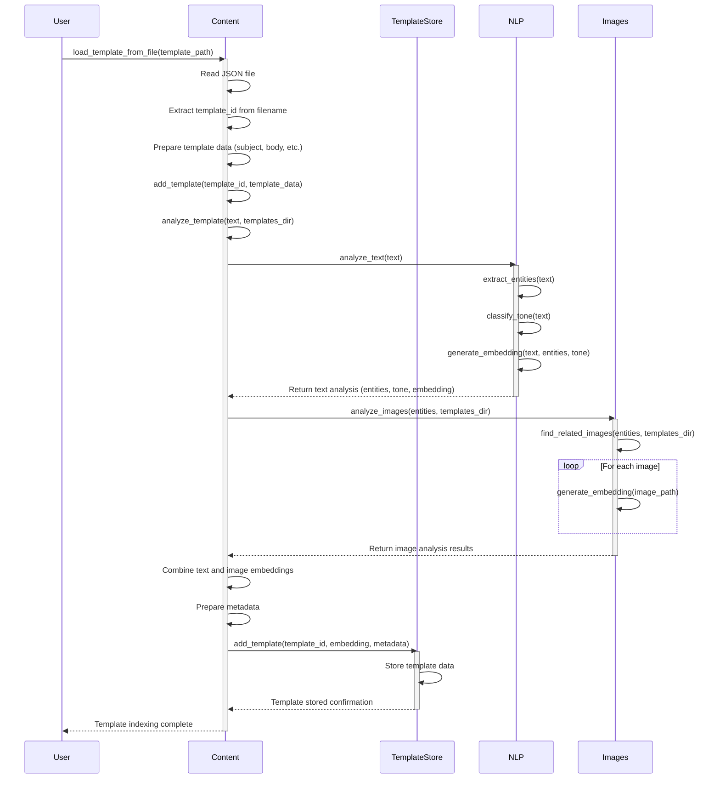

# Template Indexing Process

1. **Data Preparation**: The system reads the JSON file, extracts the template ID from the filename, and prepares the template data structure.

2. **Text Analysis**:
   - Extracts named entities from the template text
   - Classifies the emotional tone of the text
   - Generates text embeddings that represent the semantic content

3. **Image Analysis**:
   - Finds images related to the extracted entities
   - Generates embeddings for each related image
   - Combines multiple image embeddings if necessary

4. **Embedding Combination**: The system combines text and image embeddings to create a unified representation of the template.

5. **Storage**: Finally, the template is stored in the `TemplateStore` with its:
   - Template ID
   - Combined embedding
   - Metadata (including entities, tone analysis, and related image paths)

This indexing process enables powerful template searching and matching capabilities based on both textual and visual content. 

