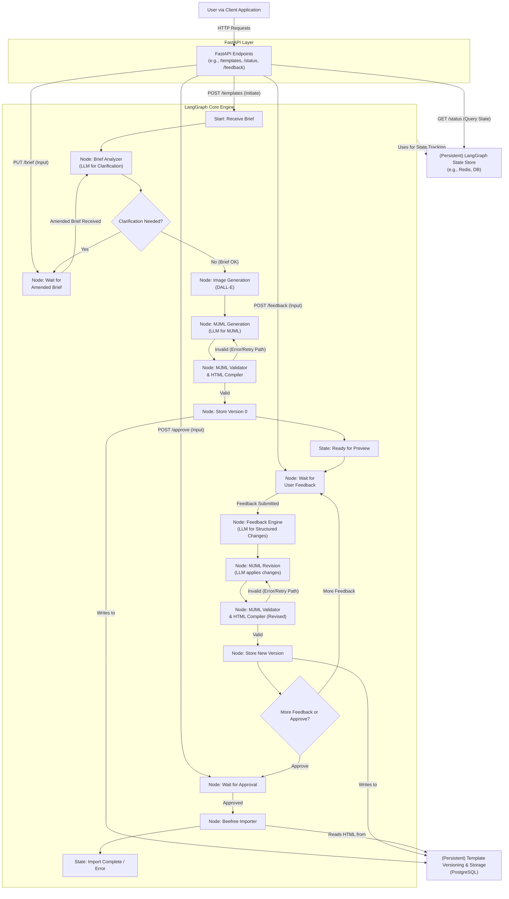

# Xyra Marketing Content Agent - Phase 1 Plan: MJML Email Template Generation (LangGraph Architecture)

## 1. Project Overview & Phase 1 Goals

This document outlines the plan for Phase 1 of the Xyra Marketing Content Agent project, adapted to leverage **LangGraph** for core workflow orchestration. The primary goal remains to develop an AI-powered agent capable of generating professional-grade, responsive email templates in MJML format. This phase will also include the capability to generate relevant imagery, allow for iterative refinement through natural language feedback, and import the final HTML (compiled from MJML) into the Beefree WYSWYG editor.

The adoption of LangGraph aims to simplify the management of complex, stateful workflows involved in template generation and refinement, reducing the need for custom orchestration code within the API layer.

**Key Objectives for Phase 1 (derived from [`instructions.md`](instructions.md:1)):**

*   **MJML Generation:**
    *   Accept textual content briefs, subject lines, body copy, and image suggestions as input.
    *   Generate high-quality, responsive MJML templates directly from user input.
    *   Utilize AI for structured and reliable MJML generation.
*   **AI-Driven Input Clarification:**
    *   Before generation, employ AI to analyze the user's initial brief, identify critical ambiguities or missing information, and ask targeted clarifying questions.
*   **Image Generation:**
    *   Automate image generation using DALL-E 3 or a similar technology, ensuring high-quality, visually consistent assets relevant to the email content.
*   **Iterative Refinement Loop:**
    *   Allow users to preview the generated template (HTML compiled from MJML).
    *   Enable users to request changes using natural language.
    *   Use AI to interpret feedback and modify the MJML source.
*   **Versioning:**
    *   Implement a system for versioning templates as they are refined.
*   **MJML to HTML Compilation:**
    *   Provide automatic compilation from the generated MJML to HTML.
    *   Ensure inline CSS for maximum compatibility across email clients.
*   **Beefree Integration (Phase 1.1):**
    *   Integrate with the Beefree HTML Importer API (`https://docs.beefree.io/beefree-sdk/apis/html-importer-api`) to pull the compiled HTML into their platform.
*   **System template:**
    *   template the system with future scalability in mind, particularly for integrating a Retrieval Augmented Generation (RAG) component and for expanding to other marketing channels. LangGraph's structure supports this modularity.

## 2. Proposed Architecture for Phase 1 (LangGraph-Centric)

The Phase 1 architecture will utilize **LangGraph** to define and manage the stateful, multi-step workflow of template generation and refinement. A **FastAPI** application will serve as the asynchronous API gateway, handling client requests and interacting with the LangGraph engine.

**Core Principles:**

*   **LangGraph for Orchestration:** The complex sequence of operations (brief analysis, LLM calls, image generation, validation, feedback loops) will be modeled as a graph within LangGraph. Each step becomes a node, and transitions are defined by edges.
*   **State Management by LangGraph:** LangGraph will manage the state of each template generation process. This state can be persisted (e.g., using Redis or a database; for initial Sprint 1 development, `AsyncSqliteSaver` will be used) and queried, simplifying custom state tracking.
*   **FastAPI as an Asynchronous Interface:** FastAPI will handle HTTP requests, initiate LangGraph executions, pass user inputs (like feedback or amended briefs) to the appropriate points in the running graphs, and query graph states to provide status updates to the client.
*   **Asynchronous Operations:** Client interactions with FastAPI will follow an asynchronous request/response pattern (e.g., `202 Accepted` for long-running operations, with polling for status). The underlying LangGraph execution is also inherently designed for potentially long-running, stateful processes.



**Component Interaction:**

1.  **User Input & Graph Initiation:**
    *   The user submits an initial brief to `FastAPI` (e.g., via `POST /templates`).
    *   `FastAPI` validates the request and initiates a new **LangGraph execution**, passing the brief as initial input/state. It returns a `202 Accepted` response with a `graph_execution_id` (can serve as `template_id`) and `status_poll_url`.
    *   The LangGraph begins execution at its `StartNode`.

2.  **AI Clarification (within LangGraph):**
    *   The graph transitions to the `Brief Analyzer Node`. This node (an LLM call) processes the brief.
    *   The graph's state is updated with either clarification questions or an "OK" status.
    *   The client polls `FastAPI`'s `status_poll_url` (e.g., `GET /templates/{graph_execution_id}/status`). `FastAPI` queries the current state of the LangGraph execution.
    *   If clarification is needed (graph is at a "clarification_needed" state), the response includes questions. The user submits an amended brief (e.g., via `PUT /templates/{graph_execution_id}/brief`). `FastAPI` sends this amended brief as an event/input to the waiting LangGraph (e.g., at `WaitForAmendedBriefNode`).
    *   The graph then proceeds, potentially re-running analysis or moving to generation.

3.  **Initial Generation & Versioning (within LangGraph):**
    *   Once the brief is OK, the LangGraph transitions through nodes for `Image Generation`, `MJML Generation`, and `MJML Validation/Compilation`.
    *   These nodes execute their respective tasks (DALL-E calls, LLM for MJML, `mjml` CLI). Errors within these nodes can lead to alternative paths within the graph (e.g., retry, error state).
    *   If successful, the graph transitions to a `StoreV0Node` which writes the initial version (MJML, HTML, assets) to the `Template Versioning and Storage` (PostgreSQL).
    *   The LangGraph state is updated to `ready_for_preview`.

4.  **Preview & Refinement Loop (FastAPI interface, LangGraph core loop):**
    *   The client, upon seeing `ready_for_preview` from polling `FastAPI`, retrieves the HTML for preview (e.g., `GET /templates/{graph_execution_id}/versions/v0/html`). `FastAPI` serves this from the `TemplateStoreDB`.
    *   If the user has feedback, they submit it to `FastAPI` (e.g., `POST /templates/{graph_execution_id}/feedback`).
    *   `FastAPI` sends this feedback as an event/input to the LangGraph, which would be at a `WaitForFeedbackNode`.
    *   The LangGraph then cycles through: `Feedback Engine Node` (LLM to structure feedback) -> `MJML Revision Node` (LLM to apply changes) -> `MJML Validation/Compilation Node`.
    *   If valid, a `StoreVNextNode` saves the new version. The graph state updates to `ready_for_preview` for the new version.
    *   The client polls and continues the loop.

5.  **Approval & Beefree Import (FastAPI interface, LangGraph execution):**
    *   When the user approves a template, they send an approval request to `FastAPI` (e.g., `POST /templates/{graph_execution_id}/versions/{version_id}/approve`).
    *   `FastAPI` sends an approval event to the LangGraph, which would be at a `WaitForApprovalNode`.
    *   The LangGraph transitions to the `Beefree Import Node`, which retrieves the approved HTML (from `TemplateStoreDB`) and pushes it to Beefree.
    *   The LangGraph state updates to `pending_beefree_import`, then `import_to_beefree_complete` or `error_beefree_import`. The client polls `FastAPI` to see the final import status.

## 3. Detailed Component template & Functionality (LangGraph Nodes)

The core functionalities described in the original plan will be encapsulated as nodes within the LangGraph. Each node is typically a Python function or callable that receives the current graph state, performs an action, and returns updates to the state.

### 3.1. Input Handling & AI Clarification (`Brief Analyzer Node`)

*   **Schema:** `MJMLTemplateRequest` (subject, body, CTA, image_prompts, brand_guidelines, etc.) - this is the initial input to the LangGraph.
*   **`Brief Analyzer Node` (LLM):**
    *   Invoked as a node in the LangGraph execution flow.
    *   LLM interaction is managed via a configurable abstraction layer (using LangChain's `BaseChatModel`), allowing selection between providers like OpenAI and Anthropic.
    *   Prompt: "Analyze this email template request for critical missing information or ambiguities that would prevent high-quality MJML generation. Formulate 1-3 specific questions for the user to clarify these points. Explain briefly why each piece of information is important. If the brief is clear and sufficient, indicate that."
    *   Output: Updates the LangGraph state with either `clarification_questions` and a status like `clarification_needed`, or an `brief_ok` status.

### 3.2. Core MJML Generation Module (`MJML Generation Node`)

*   **LLM Interaction:** Configurable selection of LLMs (e.g., GPT-4-turbo, Claude 3) via an abstraction layer using LangChain's `BaseChatModel`. This node is part of the LangGraph flow.
*   **Prompt Engineering:** Critical for generating structured MJML.
*   **For Initial Generation:** Takes the full, clarified brief from the LangGraph state.
*   **For Revisions:** Takes the *current MJML* and *structured change instruction* (output from `Feedback Engine Node`) from the LangGraph state. Prompt: "Given the following MJML and a structured change instruction, apply the change precisely and return the complete, updated MJML..."
*   Output: Updates LangGraph state with the generated/revised MJML, which is then passed to the `MJML Validator and HTML Compiler Node`.

### 3.3. Image Generation Module (`Image Generation Node`)

*   DALL-E 3 integration, prompt handling, asset URL management.
*   Receives image prompts from LangGraph state.
*   Output: Updates LangGraph state with image asset URLs.

### 3.4. MJML Validation & Structuring (`MJML Validator and HTML Compiler Node`)

*   Uses `mjml` CLI for validation and compilation.
*   Input: MJML source from LangGraph state (from `MJML Generation Node` or `MJML Revision Node`).
*   Output: Updates LangGraph state with compiled HTML and a validation status (valid/invalid). If invalid, the graph can branch to an error handling path or a retry mechanism (e.g., back to the generation node with error feedback).

### 3.5. MJML to HTML Compilation Module (Part of `MJML Validator and HTML Compiler Node`)

*   Uses `mjml` CLI subprocess for compilation with inlined CSS.

### 3.6. Preview & Refinement Loop Components

*   **HTML Preview Service (FastAPI Endpoint):**
    *   `FastAPI` provides `GET /templates/{graph_execution_id}/versions/{version_id}/html`. This endpoint reads from `TemplateStoreDB`. The LangGraph is responsible for ensuring the data is in the DB when the graph reaches a `ready_for_preview` state.
*   **`Feedback Engine Node` (LLM):**
    *   LLM interaction managed via the configurable abstraction layer.
    *   Input: User's natural language feedback and current MJML (both from LangGraph state, feedback injected via FastAPI).
    *   Prompt: "Analyze the user's feedback... Translate into a structured instruction..."
    *   Output: Updates LangGraph state with a JSON object representing the structured change instruction.
*   **State Management & LangGraph Statuses:**
    *   LangGraph inherently manages the state of each execution. A `LangGraph State Store` (e.g., Redis, PostgreSQL, or other checkpointer; for Sprint 1, `AsyncSqliteSaver` will be used for initial development) will persist this state, allowing for long-running and resumable workflows.
    *   Key statuses for a template generation process, retrievable by `FastAPI` querying the LangGraph state, include:
        *   `pending_brief_analysis`: Graph started, `Brief Analyzer Node` pending/running.
        *   `clarification_needed`: `Brief Analyzer Node` output questions; graph waiting at `WaitForAmendedBriefNode`.
        *   `pending_initial_generation`: Brief OK; graph proceeding to `ImageGenNode` / `MJMLGenNode`.
        *   `generating_version`: `ImageGenNode`, `MJMLGenNode`, or `MJMLRevisionNode` active.
        *   `validating_mjml`: `MJMLValidatorCompilerNode` active.
        *   `ready_for_preview`: A version compiled and stored by `StoreV0Node` or `StoreVNextNode`; graph may be at `WaitForFeedbackNode`.
        *   `processing_feedback`: `FeedbackEngineNode` active.
        *   `pending_approval`: Graph at `WaitForApprovalNode`.
        *   `approved_pending_beefree_import`: Graph proceeding to `BeefreeImportNode`.
        *   `import_to_beefree_complete`: `BeefreeImportNode` successful.
        *   `error_STATE_NAME`: Indicates an error occurred in a specific node/state (e.g., `error_mjml_generation`, `error_beefree_import`). LangGraph's structure can define specific error handling paths.
    *   The response from `FastAPI`'s `GET /status` endpoint will reflect the LangGraph's current conceptual state and any relevant data (e.g., clarification questions, preview URLs, error messages) extracted from the graph's persisted state.

### 3.7. Template Versioning & Storage (`StoreV0Node`, `StoreVNextNode` interacting with `TemplateStoreDB`)

*   **Trigger:** A LangGraph node (`StoreV0Node` or `StoreVNextNode`) is responsible for writing a new version to `TemplateStoreDB` after successful generation/refinement and validation.
*   **Schema (in `TemplateStoreDB` - PostgreSQL):** Remains the same as original plan.
    *   `template_id: TEXT` (maps to `graph_execution_id` or a related ID)
    *   `version_id: TEXT`
    *   `mjml_source: TEXT`
    *   `compiled_html: TEXT`
    *   `user_brief_snapshot: JSONB`
    *   `image_assets: JSONB`
    *   `change_trigger: JSONB` (could log the LangGraph node/event that led to this version)
    *   `created_at: TIMESTAMP`
    *   `is_approved: BOOLEAN`
*   **Storage Mechanism:** PostgreSQL.

### 3.8. Beefree HTML Importer API Integration (`BeefreeImportNode`)

*   Python client for Beefree API, executed as a node in LangGraph, triggered after the graph receives an approval event.

### 3.9. API Endpoint template (Interfacing with LangGraph)

The API, served by FastAPI, remains resource-oriented around `/templates`. Endpoints triggering LangGraph operations return `202 Accepted`.

1.  **Create New template (Initiates LangGraph Execution):**
    *   **`POST /templates`**
        *   **Request:** `{ "user_brief": { ... }, "client_id": "..." }`
        *   **FastAPI Action:** Validates, initiates a new LangGraph execution with the brief, gets a `graph_execution_id`.
        *   **Response (202 Accepted):**
            ```json
            {
              "template_id": "graph_exec_xyz123", // This is the graph_execution_id
              "task_id": "graph_exec_xyz123",    // Can be the same
              "status": "pending_brief_analysis", // Initial state of the graph
              "message": "Template creation process initiated with LangGraph.",
              "status_poll_url": "/templates/graph_exec_xyz123/status"
            }
            ```

2.  **Submit Amended Brief (Sends Input to Running LangGraph):**
    *   **`PUT /templates/{template_id}/brief`** (where `template_id` is the `graph_execution_id`)
        *   **Request:** `{ "user_brief": { ... }, "brief_token": "..." }`
        *   **FastAPI Action:** Validates, sends the amended brief as an event/input to the specified LangGraph execution (which is at `WaitForAmendedBriefNode`).
        *   **Response (202 Accepted):**
            ```json
            {
              "template_id": "graph_exec_xyz123",
              "task_id": "graph_exec_xyz123",
              "status": "pending_initial_generation", // Status after graph processes input
              "message": "Amended brief received by LangGraph. Initial generation in progress.",
              "status_poll_url": "/templates/graph_exec_xyz123/status"
            }
            ```

3.  **Get template Task Status & Results (Polling Endpoint - Queries LangGraph State):**
    *   **`GET /templates/{template_id}/status`**
        *   **FastAPI Action:** Queries the persisted state of the LangGraph execution `template_id`. Formats this state into the response.
        *   **Response (200 OK):**
            ```json
            // Example 1: Clarification Needed
            {
              "template_id": "graph_exec_xyz123",
              "task_id": "graph_exec_xyz123",
              "status": "clarification_needed", // From LangGraph state
              "clarification_questions": ["What is the primary call to action?", "..."], // From LangGraph state
              "brief_submission_token": "token_for_put_brief_xyz",
              "message": "LangGraph analysis complete. Clarification required."
            }

            // Example 2: Ready for Preview
            {
              "template_id": "graph_exec_xyz123",
              "task_id": "graph_exec_xyz123",
              "status": "ready_for_preview", // From LangGraph state
              "current_version_id": "v0", // From LangGraph state or TemplateStoreDB
              "html_preview_url": "/templates/graph_exec_xyz123/versions/v0/html",
              "mjml_source_url": "/templates/graph_exec_xyz123/versions/v0/mjml",
              "message": "Version v0 (via LangGraph) is ready for preview."
            }
            // Other statuses as defined in section 3.6
            ```

4.  **Get Specific Version Details (Once Ready):**
    *   **`GET /templates/{template_id}/versions/{version_id}`**
    *   **`GET /templates/{template_id}/versions/{version_id}/html`**
        *   **FastAPI Action:** These endpoints primarily read from `TemplateStoreDB`. LangGraph ensures the data is populated at the correct stage.
        *   **Response:** Same as original plan.

5.  **Submit Feedback for Refinement (Sends Input to LangGraph):**
    *   **`POST /templates/{template_id}/feedback`**
        *   **Request:** `{ "parent_version_id": "v1", "natural_language_feedback": "..." }`
        *   **FastAPI Action:** Sends feedback as input to the LangGraph execution (at `WaitForFeedbackNode`).
        *   **Response (202 Accepted):**
            ```json
            {
              "template_id": "graph_exec_xyz123",
              "task_id": "graph_exec_xyz123",
              "parent_version_id": "v1",
              "status": "processing_feedback", // Status after graph receives feedback
              "message": "Feedback received by LangGraph. New version generation initiated.",
              "status_poll_url": "/templates/graph_exec_xyz123/status"
            }
            ```

6.  **Approve a template Version & Trigger Beefree Import (Sends Input to LangGraph):**
    *   **`POST /templates/{template_id}/versions/{version_id}/approve`**
        *   **FastAPI Action:** Sends approval event to the LangGraph execution (at `WaitForApprovalNode`).
        *   **Response (202 Accepted):**
            ```json
            {
              "template_id": "graph_exec_xyz123",
              "task_id": "graph_exec_xyz123",
              "approved_version_id": "v2",
              "status": "pending_beefree_import", // Status after graph receives approval
              "message": "Template v2 approved. LangGraph initiating Beefree import.",
              "status_poll_url": "/templates/graph_exec_xyz123/status"
            }
            ```

## 4. Workflow for Phase 1 (LangGraph-Driven)

The workflow is defined by the structure of the LangGraph and its state transitions, initiated and interacted with via FastAPI.

1.  **template Initiation & Brief Analysis:**
    a.  User submits brief (`POST /templates`). FastAPI initiates a LangGraph execution.
    b.  LangGraph starts at `LG_Start`, moves to `LG_BriefAnalyzer`.
    c.  `LG_BriefAnalyzer` updates graph state. Graph may transition to `LG_ClarificationDecision`.
    d.  Client polls `GET /status`. FastAPI returns current LangGraph state.
    e.  If `clarification_needed`, graph is at/past `LG_ClarificationDecision` (path to `LG_WaitForAmendedBrief`). User submits amended brief (`PUT /brief`). FastAPI sends input to graph. Graph proceeds.
    f.  If brief OK, graph proceeds to `LG_ImageGen`.

2.  **Initial MJML & Asset Generation (LangGraph Flow):**
    a.  Graph flows through `LG_ImageGen` -> `LG_MJMLGen` -> `LG_MJMLValidateCompile`.
    b.  If validation fails, graph can take an error/retry path (e.g., back to `LG_MJMLGen`).
    c.  If successful, graph to `LG_StoreV0` (writes to `TemplateStoreDB`).
    d.  Graph state becomes `ready_for_preview` (may be at `LG_WaitForFeedback`).
    e.  Client polls, sees `ready_for_preview`.

3.  **Preview & Iterative Refinement Loop (LangGraph Cycle):**
    a.  Client previews HTML (FastAPI serves from `TemplateStoreDB`).
    b.  User submits feedback (`POST /feedback`). FastAPI sends input to graph at `LG_WaitForFeedback`.
    c.  Graph cycles: `LG_FeedbackEngine` -> `LG_MJMLRevision` -> `LG_MJMLValidateCompileRevised`.
    d.  If successful, to `LG_StoreVNext`. Graph state to `ready_for_preview` (for new version), then to `LG_LoopDecision`.
    e.  `LG_LoopDecision` routes back to `LG_WaitForFeedback` or to `LG_WaitForApproval` based on (implicit or explicit) user intent.
    f.  Client polls, loop continues.

4.  **Approval & Beefree Import (LangGraph Flow):**
    a.  User approves (`POST /approve`). FastAPI sends input to graph at `LG_WaitForApproval`.
    b.  Graph to `LG_BeefreeImport`.
    c.  `LG_BeefreeImport` executes. Graph state to `pending_beefree_import`, then `import_to_beefree_complete` or `error_beefree_import`.
    d.  Client polls for final status.

## 5. Key Changes from Original System (Highlighting LangGraph)

*   **LangGraph-based Orchestration:** The primary change. Complex, stateful workflows are managed by LangGraph, not custom FastAPI background task logic. This simplifies FastAPI's role to an API gateway and graph interactor.
*   **Simplified State Management:** LangGraph's built-in state management and checkpointer capabilities reduce the need for custom state tracking mechanisms for the workflow itself.
*   **Clearer Workflow Definition:** The agent's logic is explicitly defined as a graph, improving understandability and maintainability.
*   **Reduced Custom Orchestration Code:** Less boilerplate in FastAPI for managing sequences, retries (if built into graph), and dependencies between asynchronous steps.
*   **Interactive Workflow:** Maintained and potentially enhanced by LangGraph's ability to pause and resume based on external inputs.
*   **Versioning:** Still explicit, triggered by LangGraph nodes completing generation/refinement steps.

## 6. Future Considerations (Post-Phase 1)

*   **RAG Integration:** Can be added as new nodes or a sub-graph within the LangGraph framework.
*   **Advanced Iterative Refinement:** LangGraph's structure can support more complex conditional logic and branching for sophisticated feedback handling.
*   **Enhanced Asynchronous Task Management & Observability:**
    *   LangGraph's checkpointer system provides inherent persistence and resumability.
    *   Tools like LangSmith (if used) can offer excellent visualization, debugging, and tracing of LangGraph executions.
    *   Error handling can be explicitly designed as paths within the graph.
*   **Webhooks/SSE:** FastAPI could still implement these, triggered by LangGraph reaching certain states (e.g., by having a graph node make an internal call or FastAPI monitoring graph state changes).

## 7. Technology Stack & Dependencies

*   Python 3.10+
*   FastAPI
*   **LangGraph**
*   **LangChain (core, community for LLM integrations, etc.)**
*   aiosqlite (for `AsyncSqliteSaver` checkpointer in Sprint 1)
*   Uvicorn, Gunicorn
*   Selected LLMs (e.g., OpenAI GPT-4 series, Anthropic Claude 3 series) accessed via a configurable LangChain abstraction layer.
*   `langchain-openai` (for OpenAI models via LangChain)
*   `langchain-anthropic` (for Anthropic models via LangChain)
*   DALL-E 3 (or alternative)
*   MJML (`mjml` CLI via subprocess)
*   PostgreSQL (for `TemplateStoreDB` and potentially `LangGraph State Store` in later phases; `AsyncSqliteSaver` will be used for the LangGraph State Store in Sprint 1)
*   Redis (optional, for caching, or as an alternative `LangGraph State Store` checkpointer for later phases if not using PostgreSQL)
*   Pydantic
*   Alembic (for database migrations)
*   `python-multipart` (for file uploads if any)
*   `httpx` (for async external API calls from FastAPI or LangGraph nodes)
*   `pytest` (for unit and integration testing)
*   `pytest-asyncio` (for testing asynchronous code with pytest)

## 8. Success Metrics for Phase 1

*   **API Robustness & Usability:** (As original plan)
*   **AI Clarification:** (As original plan)
*   **Iterative Refinement Loop:** (As original plan)
*   **Versioning:** (As original plan)
*   **Workflow Maintainability & Clarity:**
    *   Ease of understanding and modifying the generation/refinement workflow due to the LangGraph visual/code structure.
    *   Reduced complexity in the FastAPI layer related to task orchestration.
*   (Other metrics as previously defined: MJML quality, image quality, compilation, Beefree import).

## 9. Proposed Project File Structure (Adjusted for LangGraph)

```text
.
├── .gitignore
├── README.md
├── requirements.txt
├── docs/
│   ├── plan_langgraph.md     # This file
│   ├── instructions.md
│   └── legacy_systems/
│       ├── template_indexing_overview.md
│       └── html_generator_overview.md
├── archive/
│   └── cuda-test.py
├── xyra/
│   ├── __init__.py
│   ├── main.py                 # FastAPI app instance, main startup
│   ├── config.py               # Application settings
│   ├── core_services/          # Logic for individual LangGraph nodes/LLM interactions
│   │   ├── __init__.py
│   │   ├── __init__.py
│   │   ├── llm_factory.py        # Factory for LLM instances
│   │   ├── brief_analyzer_service.py
│   │   ├── image_generator_service.py # (Planned)
│   │   ├── feedback_engine_service.py # (Planned)
│   │   ├── mjml_service.py       # (Planned for MJML generation, validation, compilation logic)
│   │   └── beefree_service.py    # (Planned)
│   ├── graphs/                 # LangGraph definitions
│   │   ├── __init__.py
│   │   └── template_generation_graph.py # Defines the main LangGraph
│   │   └── state.py              # Defines the graph's state schema
│   ├── api/                    # API layer (FastAPI routers)
│   │   ├── __init__.py
│   │   ├── deps.py
│   │   └── v1/
│   │       ├── __init__.py
│   │       ├── router.py
│   │       └── template_routes.py # FastAPI routes interacting with LangGraph
│   ├── db/                     # Database related modules
│   │   ├── __init__.py
│   │   ├── template_store.py     # For TemplateStoreDB (MJML versions)
│   │   ├── langgraph_checkpointer.py # Placeholder if using a custom DB checkpointer for LangGraph (e.g., PostgreSQL in later phases). Sprint 1 uses built-in AsyncSqliteSaver.
│   │   └── models.py           # SQLAlchemy models
│   ├── schemas/                # Pydantic schemas
│   │   ├── __init__.py
│   │   ├── template_schemas.py
│   │   └── common_schemas.py
│   └── utils/                  # General utility functions
│       ├── __init__.py
│       └── mjml_cli_utils.py
├── tests/
│   ├── __init__.py
│   ├── conftest.py
│   ├── unit/                   # Unit tests
│   │   ├── __init__.py
│   │   ├── test_llm_factory.py
│   │   ├── test_brief_analyzer_service.py
│   │   └── graphs/
│   │       └── test_checkpointer.py
│   ├── integration/            # Tests for LangGraph flows (Planned)
│   ├── api/                    # API layer tests
│   │   └── v1/
│   │       └── test_template_routes.py
│   ├── Xyra API - TemplateGen Tests.postman_collection.json
│   └── beefreetester/
│       ├── Blob.js
│       ├── fileSaver.js
│       └── index.html
└── scripts/
    └── run_dev.sh
```
**Key changes in file structure:**
*   `xyra/graphs/`: New directory to house LangGraph definitions (`template_generation_graph.py`, `state.py`).
*   `xyra/core_services/`: Now primarily contains the business logic that will be wrapped into LangGraph nodes.
*   `xyra/tasks/` (from original plan for Celery/FastAPI tasks) is removed, as LangGraph handles this level of orchestration.
*   `xyra/db/langgraph_checkpointer.py`: Added as a placeholder if a custom database checkpointer for LangGraph state is implemented.

This LangGraph-centric plan aims for a more robust, maintainable, and understandable system for the complex workflows involved in the Xyra Marketing Content Agent.